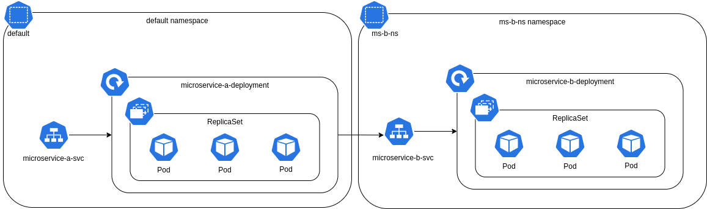

# K8S Student Lister

## Intoduction

The following repository consists of two micro-services that depend from eachother.

- __Micro-service A:__ The micro-service which will be exposed to our clients. It is implemented using _Gin_, a Go framework.
- __Micro-service B:__ The micro-service consists of the datasource. It's a _Spring Boot_ API, in which we can query the students data.

Both of these micro-services are deployed on a kubernetes cluster, in which they communicate using services!

## Diagram

<p
    align="center"
>
    
</p>

## To Do

Deploy the micro-services on an AKS cluster and expose it to the internet with the _ingress_. Then add the domain locally in _/etc/hosts_.

``` shell
kubectl cluster-info # get the IP address of the cluster
```

Then add `students.gl5 <IP-ADDRESS>` in _/etc/hosts_.
